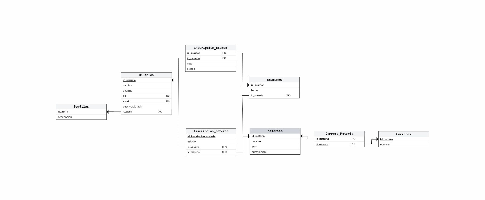

# GestAcad

## Descripción del Proyecto
## Requisitos Previos
- Tener Python Intalado
- Tenen pip instalado

### Instalar la libreria de entornos virtuales

```bash
pip install venv
```
### Crear un entorno Virtual

```bash 
python -m venv env
```

### Activar Entorno

- Windows
```bash
./env/Scripts/activate
```

- Linux
```bash
source env/bin/activate
```
### Instalar los requerimientos del proyecto

```bash 
pip install -r requirements.txt
```

## Instalar PostgreSQL Linux

```bash
sudo apt install postgresql
```

### Crear la base Datos
```bash
psql -U postgresql
CREATE DATABASE gestacad
```

### Descargar las credenciales y exportalas
```.env
DB_NAME=gestacad
DB_USER=postgres
DB_PASS=postgres
DB_HOST=localhost
DB_PORT=5432
```

### Exportar las variable
```bash
export $(grep -v '^#' .env | xargs)
```

### Ejecutar las migraciones
Posicionarce en la carpeta core
```bash
cd core
```
Ejecutar Migraciones
```bash
python manage.py migrate
python manage.py makemigrations GesAcad
```

### Ejecutar el Servidor
```bash
python manage.py runserver
```

Ingresar en http://127.0.0.1:8000

## DER


